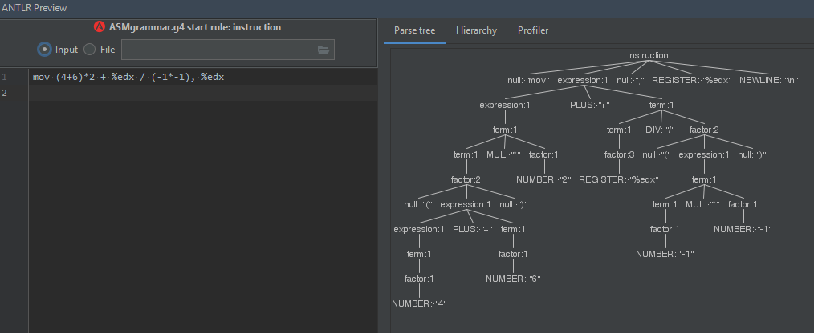

# basicASM
Interpreter podstawowych instrukcji assemblera z wykorzystaniem ANTRL.
np:

mov (4+6)*2, %edx

push %edx*2

int 0x80

mov 4 - 1, %ecx

xor %ebx, %ebx

mov %ebx + 3 + %edx*2 + 5 - %ecx, %ecx

Wykorzystuje obiekt typu ParseTreeWalker, który pracuje z napisanym przeze mnie Listenerem do "reagowania"

na napotkane elementy drzewa parsowania.

Pamięć zorganizowana jest zgodnie ze wzorcem Singleton.

Do obsługi rejestrów użyto HashMap oraz LinkedList jako kolejki LIFO.

Program obsługuje również liczby ujemne na co należy uważać przy testowaniu tzn.

jak we wzorcowym pliku input operator powinien  być oddzielony przynajmniej 1 spacją od "obiektów" poddawanych operacji.

np.

push 10 - 10 - poprawnie

push 10 --10 - poprawnie

push 10 -10 - niepoprawnie(program rozpoznaje liczbę 10 oraz -10 - brakuje operatora)

